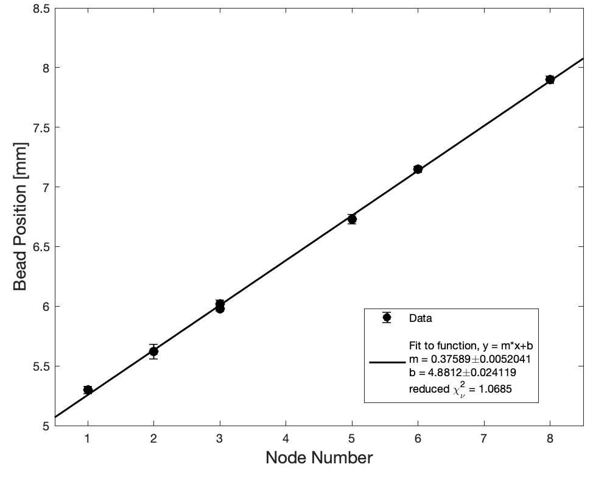

## Week 3

1. [Background: Data Analysis](#background-reading-for-data-analysis)
2. [Instructions: In Lab this Week](#instructions-for-in-lab-this-week)
3. [What you need to leave lab with this week](#what-you-need-to-leave-lab-with-this-week)
3. [Checkpoint #3](#checkpoint-#3)

### Background Reading for Data Analysis
One of the most important ideas we want you to take from Module 2 is to think of a data set as a whole, not as individual points. 

In the analysis you completed in weeks 1 and 2, you measured the spacing between a single, fixed number of nodes. But the “node number” provides us with an independent variable that we can control, so by measuring the position of multiple nodes, we can create a plot of position versus node number. Plotting the data and looking at the data set as a whole gives us confidence in our ability to determine the speed of sound, since it allows us to fit the data to the theoretical prediction in a more robust way. You do not need beads in every node to use this method, but you do need to use sound judgment and consistency with the theory to appropriately assign the node numbers to your levitated beads. 

At the end of Module 1 we introduced MATLAB and used it to generate a horizontal line of best fit. In this module we will continue to use MATLAB for data analysis. 

How do we extract a slope from our measured data? You have previously fit a horizontal line, but now you will fit a line with a nonzero slope. To understand this fitting process, you now need to carefully read the [curve fitting guide](curve-fitting){:target="_blank"}. In it you will find a MATLAB script that includes a linear fit with both an intercept and a slope.

To ensure you are prepared to analyze your data, please make use of the following figure to answer the subsequent mini-question.

{:target="_blank"}
----

#### Miniquestion 1: Estimating the speed of sound from a sample plot
[*Click here to open in a new tab*](https://docs.google.com/forms/d/e/1FAIpQLSdyYDI3QEI4FDsfW4d0M4krPmhwPUsgcYBsDG48WcajfMYhgg/viewform?usp=sf_link){:target="_blank"}

<iframe src="https://docs.google.com/forms/d/e/1FAIpQLSdyYDI3QEI4FDsfW4d0M4krPmhwPUsgcYBsDG48WcajfMYhgg/viewform?embedded=true" width="640" height="300" frameborder="0" marginheight="0" marginwidth="0">Loading…
</iframe>

-----

## Lab Instructions for Week 3

### Collection of Preliminary Data

Make sure you are using the same levitator as last week (you should have made note of the levitator number).

Last week should have convinced you that parallax is a significant source of uncertainty in this experiment. You also should have come up with a strategy to minimize its effect and then estimated the magnitude of its effect through multiple trials in which you randomized the position of the ruler as well as the relative position of the camera and levitator.

This week we are going to collect a data set that will allow us to obtain a more accurate estimate of the speed of sound by fitting a line representing the bead position as a function of node number.

To do this you will need a reliable mark on your levitator that you can use as a consistent origin to compare data from multiple photos. This should not be a bead (can you think why? If unsure talk to your section instructor) and also should be attached to the levitator (if you instead used for example a point on the table there is a risk it might move between images, e.g. if the levitator moved). This time you want to position as many beads in the levitator as you can. Aim for at least 5 but hopefully you can get more than that (remember that you will be graded on quality of data). **You may find it easier to trap more beads in the levitator if you rotate the levitator by 90$$\^\cdot$$ and trap the beads in vertical column.** This is worth trying! It is okay if you skip some nodes as long as you keep track of where they are so you can assign each bead to a node number. 

Once you have a good image with at least 5 beads you should perform an analysis of the first photo - doing a preliminary analysis along the way can save you time by ensuring there aren't any major flaws in your data collection before collecting a full set of data.

### Analysis of Preliminary Data
Prepare a plot of bead position vs. node number with the curve fitting script provided at the start of this week's instructions. Since your data from a single photo will not have uncertainties on the individual data points you should use the unweighted version of the linear regression script. 

Your goal is to use five distinct photos to estimate the position of each node (based on the position of beads). To prepare for this you will want to set up a sheet in your assigned spreadsheet for this module. At the top you will want to indicate that you are measuring the position of beads relative to the origin in (mm). You will want to assign a column for each node #. Note that while the assignment of which node is "node 1" is arbitrary, it needs to be at a consistent location between photos. That means that if you assign "node 1" to be the left-most bead in your first photo and then have a later photo in which you were able to levitate more beads further to the left, you will have to assign these "node 0", "node -1", etc., extending leftward. This is fine. The $$y$$-intercept of your plot of bead position vs. node number is arbitrary in this case; we are only interested in the slope.

To get a good set of data you will need to adjust for/minimize rotation in your image - make sure you measure the distance from your origin to the beads along the direction parallel to the axis of the column/row of beads.

Prepare a plot of bead position vs. node number with the curve fitting script provided at the start of this week's instructions. Since your data from a single photo will not have uncertainties on the individual data points you should use the unweighted version of the linear regression script for your preliminary data analysis from a single photo. 

### Collection of Complete Data Set

Once you are satisified with your results from a single image you need to collect a complete data set (5  distinct photos) so that you can estimate the uncertainty.

Like last week you should reposition the ruler as well as the position of the levitator relative to the camera in between each measurement, but this time **you will also need to levitate a fresh set of beads for each photo.**

**You are not required to analyze all of your data for this week's checkpoint. But you are required to take at least 5 different pictures that you will use for your data analysis and to analyze at least one of them.**

As for Module 1, you will need an uncluttered image or images of your experimental setup (with a scale bar) for your deliverable. In this case it is likely that you will find the images you've already taken will meet your needs. But just in case, before leaving lab take a moment to think if you need to take any additional photos to showcase your experimental procedure in the deliverable.

Make sure to note which levitator you are using (it should be the same one that you used last week).

If you have extra time you should begin analyzing your other four photos.

## What you need to leave lab with this week

+ 5 images of levitated beads for which you both reset the ruler and the beads. Each image needs to include at least 5 beads, more would be preferable.

+ A linear regression fit to data extracted from one of the five images

# Checkpoint #3

+ A screenshot of your organized spreadsheet which is set-up for analysis of 5 images although you are only expected to have analyzed one for this checkpoint.

+ A plot of bead position vs. node number, prepared in MATLAB, based on the results you extracted from a single image. For this week only your individual data points are not expected to include uncertainties. Please display the fit parameters on the plot (the provided script will do this for you).

+ A calculation of the speed of sound with uncertainty based on your line of best fit to the plot.

+ A statement responding to the following question: Do you think the uncertainty provided by the results of the linear regression fit to your data fully captures the uncertainty in your experiment. Please answer in 1--2 sentences.

