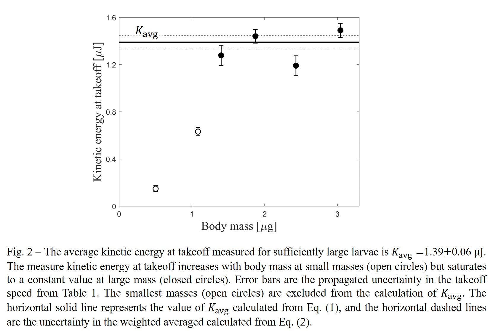

# Week 4: DRAFT.  DO NOT FOLLOW YET!

In Physics 50, you will ultimately get to experience what it’s like to create a physics poster, which is like a mini version of a physics paper. In Module 1, you created a single figure with a caption. For the Module 2 deliverable, you will produce a series of figures, with captions, that summarize the method and logic you used, leading to your final result for the liquid viscosity in this module.  

First, you should remind yourself of the [guidelines for creating a single figure](https://physics-50.github.io/Module-1/week4){:target="_blank"}, and look up any feedback you received about your Module 1 deliverable on Gradescope. We are building off of the single figure from Module 1, and the same standards apply to each of the figures you create for the Module 2 deliverable.

**THE INSTRUCTIONS FOR THE MODULE 2 DELIVERABLE WILL BE RELEASED FRIDAY OCTOBER 16**

Until then, we have our Ph50 Fall Break. After you submit your Week 3 checkpoint, you can take a break. The Module 2 Deliverable is due Friday October 23. 

## How to use a sequence of figures to make a claim

Coming Friday October 16

## Example of a sequence of figures

-----------------------------------

-----------------------------------

## When to use a table vs figure?

Coming Friday October 16

---------------------------

## Module 2 Deliverable

What do I need to make for Module 2?

For Module 2, your deliverable is a series of two to four figures, summarizing the data and analysis you used (including the logic that drove your decisions) and leading up to your final result for the viscosity of the liquid in this module.  Keep in mind that your figures should make the overall process and results understandable to someone who has your physics background but who is not enrolled in this course and has not seen the experimental videos or read any of the instructions.  Your final result for the liquid viscosity (including uncertainty!) should be given somewhere in the last figure or its caption.
