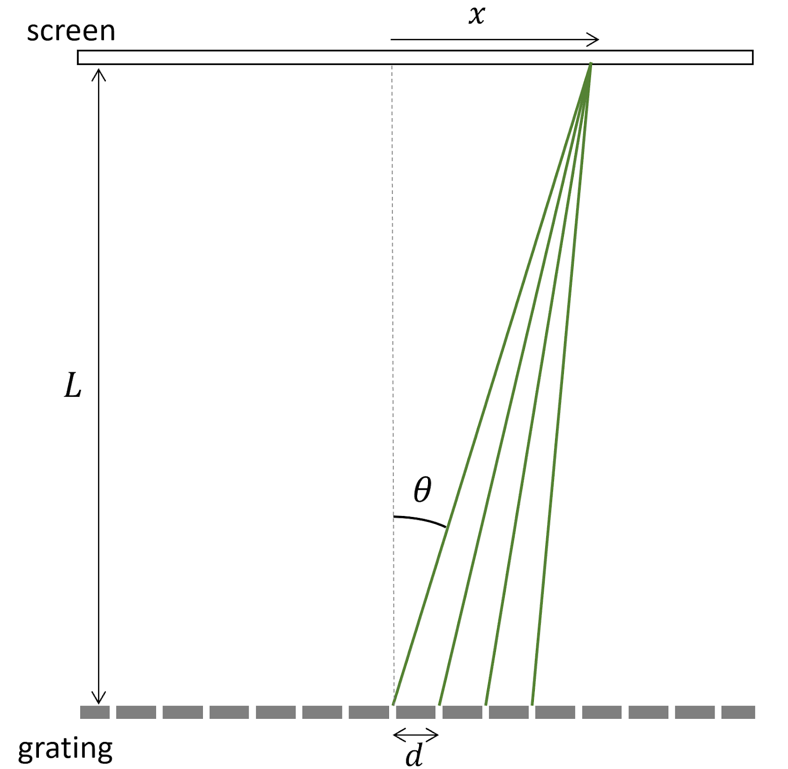
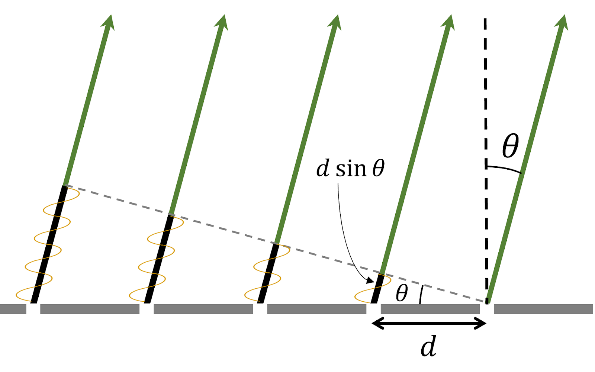
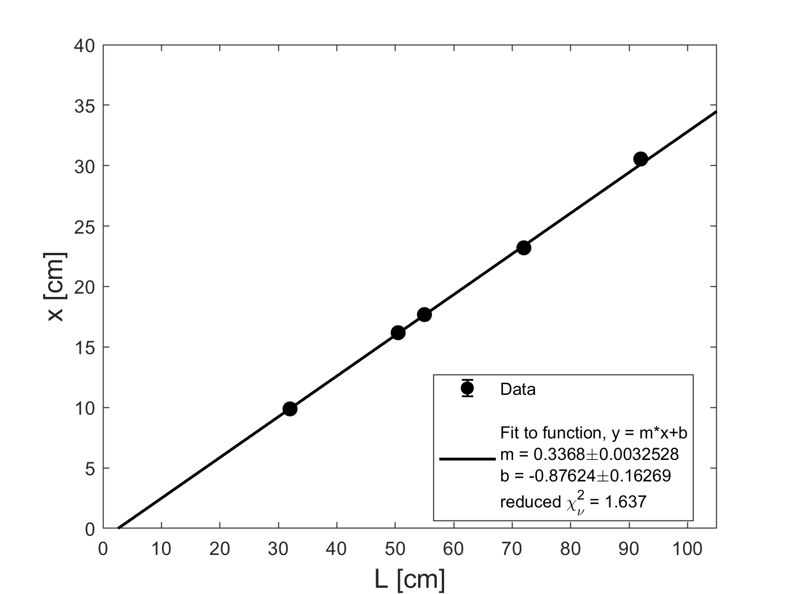

# Module 2 Week 1 Pre-lab

You should have received new Google Doc and Google Sheets notebooks through Google classroom. Please make use of the new notebooks for this module. 

In this module you will be studying a light interference effect called **diffraction**. By leveraging this phenomenon, you will use a ruler and your naked eye to measure the line spacing of a grating, even though the lines are only about 0.001 mm (1 micrometer) apart!  Diffraction as a tool for measuring small-scale periodic structure has applications from biology -- including Rosalind Franklin's famous double-helix data -- to materials science and many other fields.

## Background

In Module 1 we worked with sound as a wave of air pressure; in this module we will be viewing light as an electromagnetic wave--- a set of periodic oscillations of electric and magnetic fields, propagating through empty space at speed $$c$$.  In the last module we considered how two waves traveling in opposite directions could sum, or _interfere_, to produce a standing wave.  In this module, we will again be considering interference, but in this case of waves traveling in almost the same direction as each other.  

In the diffraction scenarios we will consider, a monochromatic plane wave of light -- that is, a wave of a certain wavelength and frequency and with simple, planar wavefronts -- is incident on a barrier with a series of small openings (_apertures_) in it.  The light that makes it through each small aperture travels outwards from that spot, and on a screen far downstream we observe a regular **_diffraction pattern_** that comes from the interference between the light waves coming from all of the individual apertures.  Before we get into the mathematical details, let's get a better visualization of what is happening by thinking about water waves. In the right half of the photo below (taken for Google Earth off the Australian coastline) we can see water waves traveling as a plane wave from right to left and encountering a series of apertures.

**Figure 1**: A photo off the coast of Australia showing the diffraction of a wave as it passes from right to left through several **apertures**, or openings, in a rocky barrier. First, notice that the wave coming out of each aperture is no longer a **plane wave** with straight wavefronts but rather is coming out as circular ripples traveling away from the center of the aperture. It is as though the aperture is a wave source of its own, sending waves out in all forward directions rather than just the initial right-to-left direction! Second, notice that the circular wavefronts from several apertures begin to overlap with each other to the left of the apertures. The overall downstream pattern of strong and weak disturbance created by the cured wavefronts interfering with each other is called the _**diffraction pattern**_. *Photo credit: Google Earth.*

Let us now return to light waves, which behave just as we have seen above for water waves.  If you send a single laser beam through a narrow slit and observe the light that has passed through the slit on a screen then you will see two main effects, as shown below in Figure 2. First, the light spreads out over a much broader angle than the original laser beam---even though the slit was much narrower than the original laser beam. This behavior is similar to what we saw for water waves in the photo above: a narrow aperture sends waves out in all directions, not just the original direction. Second, the spread-out light displays an interference pattern. The interference pattern here comes from superposition of waves spreading out from the different spots within the same narrow slit.

 **Figure 2**: The diffraction pattern from a monochromatic light source traveling through a single slit.

The mathematical details of how the interference pattern comes about are beyond the scope of Physics 50, but the take-away is this. After passing through the single-slit aperture the beam will form a central, spread-out bright spot and sometimes several dimmer spots on either side. The width of the central bright spot depends upon the frequency and wavelength of the monochromatic (single-wavelength) light passing through the slit, as well as the size of the slit and the distance between the slit and the screen upon which you are observing the pattern. A narrower slit causes a wider central diffraction spot.

Now let’s imagine the laser light passes through two slits rather than one. In other words, the laser beam is now blocked by an opaque slide that has two narrow, identical slits that the light can pass through. The light passing through two slits will now create a pattern as shown below in Figure 3.

**Figure 3**: Diffraction pattern from laser light passing through a double slit. What similarities and differences do you observe between the single slit (Figure 2) and double slit patterns?

To understand the pattern of bright spots caused by two slits, we consider the light traveling outward from each slit. Figure 4 below shows a simplified schematic of the waves emanating from two slits - the semicircular curves represent wave crests, and the separation between the curves is the wavelength of the light. This schematic is dramatically not to scale, since typically both the spacing $$d$$ between the slits and the wavelength $$\lambda$$ of the laser light are much, much smaller than the distance $$L$$ between the slits and the screen where the diffraction pattern is being viewed.

**Figure 4**: Simplified schematic of light waves passing upward through a double-slit slide, leading to constructive interference at certain angles---red lines indicate angles where the two waves interfere constructively to cause bright spots where the red lines meet the screen. *This schematic is very much not to scale.*

In Figure 4, the red lines represent positions where wave crests interfere constructively with each other---that is, the positions where the two waves are in phase and superpose to give a large-amplitude wave overall. Notice that constructive interference happens at certain angles away from the straight-ahead direction, leading to the specific bright spots located where the red lines meet the screen in the figure. Between these maxima, there are dark spots at angles where the two waves interfere destructively with each other -- that is, positions where the two waves are out of phase and perfectly cancel each other out.

## Diffraction Gratings

In Module 2, you will be investigating the diffraction pattern caused not by two slits, but by a **diffraction grating** with many, many slits, all separated by the same distance $$d$$. For such a scenario, it’s not as easy to see the angles of constructive interference by drawing the wave crests (see Fig. 5 below). 

**Figure 5**: Schematic of wave crests emerging from a diffraction grating. *This schematic is very much not to scale.*

 

Instead of drawing out wave crests, for the diffraction grating we will think about the light as rays emanating in all directions from each slit, and focus on just those rays that all eventually land at a single point on the screen, as shown by the green lines in Fig. 6. For simplicity, only 4 rays have been shown, from four neighboring slits. Each ray ends at the same point a distance $$x$$ from the center of the screen, and we are interested in whether the light from the 4 slits interferese constructively or destructively at this point.  We emphasize that this schematic is very, very much not to scale.

 

**Figure 6**: Schematic of light rays emerging from a diffraction grating. Only four rays have been sketched, and all four reach the same point on the screen, a distance $$x$$ away from the center. *This schematic is very much not to scale.*

In real situations we care about, the distance $$d$$ between the slits in the diffraction grating is six orders of magnitude smaller than the distance $$L$$ between the grating and the screen---that's like the difference between 1 cm and 10 km! Under these conditions makes sense to use the following approximation, which offends our sense of geometry definitions but is very accurate for our experiment:

**We can approximate that all the rays that end at the same point on the screen are parallel to one another.**

That means that the four green lines in Fig. 6 are treated as approximately parallel to each other as long as $$L \gg x$$. A better-scaled and ultimately more useful drawing would zoom in to just the region right above the diffraction grating, where the screen is *way* out of view and the rays that are all headed to the same position $$x$$ are shown in Fig. 7.

 

**Figure 7**: Schematic of light rays emerging from a diffraction grating. All five rays shown land at the same point on the very distant screen. The paths of the five rays to the screen are the same above the diagonal dashed line, but differ in the portions shaded black below the dashed line. *This schematic is reasonably to scale.* 

In Fig. 7, we can see that the distance traveled by the light to get to the screen is different along rays coming from different slits. Relative to the rightmost ray in Fig. 7, each consecutive ray's path is longer by an additional length $$d \sin \theta$$.  When the extra distance $$d \sin \theta$$ traveled by light on adjacent rays is equal to an integer number of wavelengths, then all the rays will interfere constructively at the point where they land on the screen, creating a bright spot.

Mathematically, this condition is met if 
\begin{equation}\label{eq:grating}
d \sin \theta = n \lambda
\end{equation}
where $$n$$ is an integer and $$\lambda$$ is the wavelength of the light.

We can do a little more to simplify this expression. From Fig. 6, we can see that $$\sin \theta = x / \sqrt{(x^2 + L^2)}$$. Substituting this into our constructive interference condition gives **_Young's equation_ for the $$n^{th}$$ bright spot from the center of our diffraction pattern:**

**\begin{equation}\label{eq:sYoung} 
\frac{xd}{\sqrt{(x^2 + L^2)} }= n \lambda
\end{equation}**

**You will use Young's equation to determine $$d$$, the line spacing of your grating, by measuring $$x$$ and $$L$$ and using the quoted value of $$\lambda$$ given by the manufacturer of your laser.**

#### Mini-question 1: Spacing of Diffraction Gratings
*[Click here to open in a new tab](https://docs.google.com/forms/d/e/1FAIpQLSc91z681gWz9ej6xEaYywPRHQWdlkKDwwGL0V46HMknP90hPg/viewform){:target="_blank"}*

<iframe src="https://docs.google.com/forms/d/e/1FAIpQLSc91z681gWz9ej6xEaYywPRHQWdlkKDwwGL0V46HMknP90hPg/viewform?embedded=true" width="640" height="400" frameborder="0" marginheight="0" marginwidth="0">Loading…
</iframe>

-----

#### Mini-question 2: Spacing of Interference Maxima
*[Click here to open in a new tab](https://docs.google.com/forms/d/e/1FAIpQLScZD277T20i9LkcYO8Uj3AM8CEtfC9wYynMl2redGVRwMuFLg/viewform){:target="_blank"}*

<iframe src="https://docs.google.com/forms/d/e/1FAIpQLScZD277T20i9LkcYO8Uj3AM8CEtfC9wYynMl2redGVRwMuFLg/viewform?embedded=true" width="640" height="400" frameborder="0" marginheight="0" marginwidth="0">Loading…
</iframe>

-----

## Goals for This Week

This week, you will use Young's equation to find the spacing $$d$$ between lines in your diffraction grating.  The printed label indicates an approximate spacing, but your measurement will refine this estimate.  After an initial exploration of sources of error, you will take a careful set of data to find $$d$$ by measuring the $$L$$ values required to make the first diffracted spot ($$n=1$$ in Young's equation) appear at different values of $$x$$.  You will graph $$L$$ as a function of $$x$$, find the best-fit slope, and use this slope and its uncertainty in Young's equation to calculate $$d \pm \delta d$$.

### The Value of Plotting and Fitting

Why don't you just set a single $$x$$ value, measure the corresponding $$L$$, and plug these into Young's equation and solve for $$d$$?  You could even do repeated trials, including varying $$x$$ if you wanted to, and average the resulting $$d$$ values.  

One of the ideas we would like you to take away from this course is to respect the power of a data set as a whole, rather than just individual points. In this case the theory suggests that, as long as we use a single grating and laser, $$L$$ and $$x$$ should be related to each other in a simple way:  they should be directly proportional.  Plotting the data and looking at the data set as a whole allows us to test this theory while letting the combined data tell us as much as possible about our results.  We will outline the approach before pointing out some of its advantages.

Let's go back to Young's equation, solve it for $$d$$, and rewrite the result in a more suggestive form:
\begin{equation}
d = n\lambda\sqrt{1+\Bigl(\frac{L}{x}\Bigr)^2} = n\lambda\sqrt{1+m^2}
\end{equation}
where we have introduced the parameter $$m=L/x$$, or the slope of a plot of $$L$$ vs. $$x$$.  (Make sure you can get this result from Young's equation.  You might want to write out the calculation in your lab notebook.)  As mentioned above, in your experiments you will focus on the $$n=1$$ diffracted spot.

Let's pause for a practice calculation and an example of what the graph of $$L$$ vs. $$x$$ might look like.

------
#### Mini-question 3: Calculating d from slope
[*Click here to open in a new tab*](https://docs.google.com/forms/d/e/1FAIpQLSewqupEcZn39DFWA4u5VqGXwGsVT5lAWeszwl0yCS0upCANug/viewform){:target="_blank"}
<iframe src="https://docs.google.com/forms/d/e/1FAIpQLSewqupEcZn39DFWA4u5VqGXwGsVT5lAWeszwl0yCS0upCANug/viewform?embedded=true" width="640" height="400" frameborder="0" marginheight="0" marginwidth="0">Loading…
</iframe>

---------------------------

There's an added power to treating the data set as a whole in this way.  First, we can test whether our data obeys the theory.  Is $$L$$ in fact a linear function of $$x$$, as the theory suggests?   Furthermore, consider what might happen if you had a systematic error that shifted all of your measured $$L$$ values.  Individual $$L/x$$ values would all be influenced by such an error, but plotting a line would give you correct slope plus a non-zero intercept, as shown in the mini-question sample data above, where the fitting parameter $$b$$ shown in the legend is clearly not equal to zero.
<!-- **Replace graph with L vs x**
 -->

At the end of this week you should have a graph and weighted fit similar to the one above but constructed from your own carefully-taken data.  You should use the fit results to evaluate the quality of your data set, and if you are satisfied with it you should calculate a final result for $$d\pm \delta d$$ based on the slope of the best-fit line and its uncertainty. 
