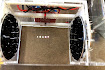

# Week 1: Exploratory Phase

--------------
1. [Introduction](#introduction)
2. [Background Reading](#background-reading)
4. [Week 1 Instructions](#week-1-instructions)

--------------

### Introduction
In this module we will be working with a rather cool piece of home-built equipment, an acoustic levitator! We will be doing far more than floating objects, however. We will also be honing one of the most important skills, some may say arts, of an experimentalist: performing accurate and precise measurements. This may not sound all that exciting at face value but it is an incredibly important part of experimental science. The GPS on my phone may be able to tell me my location on a map, but how useful would it  be if it was only certain to a radius of 5 miles? Or what if it was consistently reporting a location that was 1 mile to the east of my actual location? Understanding how well we <em>truly</em> know the value of something, being able to increase the accuracy to be useful for our application, and being certain that we are actually measuring what we think we are measuring are fundamental to good scientific practice.

### Background Reading
This week in lab you will be working with a standing wave of sound to levitate small objects (cool!). Let us take a few minutes to understand how they work.

#### A Brief Review of Standing Waves
The acoustic levitators we will use in lab make use of standing waves of sound. Let us harken back to Ph 24 for a brief review of the basics of standing waves.

As you may recall, in a transverse wave the disturbance away from equilibrium, y, in a wave traveling in the x direction can be described by the equation $$y=Asin(k x-\omega t)=Asin(2\pi(\frac{x}{\lambda}-\nu t))$$ where $$ A$$ is the maximum amplitude, $$ \nu=\frac{\omega}{2\pi}$$ is the frequency, and $$\lambda$$ is the wavelength of the wave. The speed $$ v$$ of the wave is given by $$v=\lambda \nu.$$

In the case of a wave on a string the wave travels along the length of the string and the disturbance y is the displacement of bits of string perpendicular to the length. Imagine an apparatus that consists of a string held under constant tension; one end is attached to a mechanical oscillator that jiggles the string, creating a sine wave that propagates towards the other end which is fixed (imagine it is tied to a post). The wave then hits the fixed end and reflects, creating a sine wave that propagates back toward the oscillator in the opposite direction. We now have two waves traveling in opposite directions and what we observe will be the result of these two waves added together.

Recall that the superposition of two waves traveling in opposite directions can be represented by $$y_{total}(x,t)=Asin(k x-\omega t) + Asin(k x+\omega t +\phi)$$ where the reflected wave has the same maximum amplitude as the incident wave but has picked up a phase $$ \phi$$. Our combined wave can now be represented as $$y_{total}(x,t)=Asin(k x-\omega t) - Asin(k x+\omega t )$$ where we have made use of the fact that $$ sin(\theta+\pi) = -sin(\theta)$$. Making use of one more fun fact, $$ sin(A + B)=sin(A)cos(B)+sin(B)cos(A)$$, and a little bit of algebra you can show that this simplifies to $$y_{total}(x,t)=-2Asin(\omega t)cos(kx)$$

The takeaway from this is that the position and time dependence are now separate! It is as though the wave is fixed in space along the x axis while the effective "maximum amplitude" oscillates in time as $$ 2 A sin(\omega t)$$. This is known as a standing wave and is shown in the figure below.

 

Above is a  standing wave formed by counter-propagating sine waves. The blue standing wave is the sum of the upper two traveling waves. Animation courtesy of D. Russell.

If both ends of the string are fixed (or nearly so), this puts restrictions on the wavelengths and therefore the frequencies that will produce stable standing waves on a given string. In this example, our string can be thought of has having two fixed ends <strong>--nodes --</strong>a distance L apart.  The places where the string doesn’t move ($$ y_{total}=0$$) are called <strong>nodes</strong>, whereas places where the string oscillates with maximum amplitude are called <strong>antinodes</strong>. Only particular wavelengths will allow both ends of the string to be nodes; the wavelengths and frequencies that produce this type of stable standing waves are called <strong>resonant.</strong> (Note:  We have arrived at this condition by considering the boundary conditions for the disturbance at the ends of the string.  An equivalent method would be to require that the twice-reflected wave after one round trip is perfectly in phase with the brand new wave just now being emitted by the oscillator.  This second method offers some insight into what happens when the oscillator frequency is <em>not</em> resonant:  the vibrations on the string will be unstable and tend to die out.)

What happens if instead of a fixed end we have a second mechanical oscillator shaking the string at the same frequency? We will end up with a standing wave but the ends will not be nodes and it will not be defined by a resonant condition, meaning we are free to pick any frequency. This is the situation we have in the acoustic resonator and we will revisit it in more detail in the following section.

If you wish to revisit the above concepts, consult Appendix D of <a href="http://physics.hmc.edu/private/courses/p024/motion2.pdf" target="_blank" rel="noopener"><em>Motion II</em></a> by Prof. Helliwell.

### Acoustic Levitator Theory
Air surrounds us all the time and it’s easy not to think about it at all, or to think of it as insubstantial.  But when a gust of wind blows over our beach umbrella, or a vacuum cleaner sucks up dust (or confetti, or popcorn…), it’s hard to ignore the fact that air molecules can exert force on other objects.  Specifically, these phenomena and many others involve net motion of many air molecules in response to a pressure difference.  In the case of the wind at the beach, the original pressure difference may be caused by weather patterns and by the contrasting temperature and motion of the water compared to the land.  In the case of the vacuum cleaner, the original pressure difference is caused by the vacuum action pulling air out of the canister.  Either way, air moves in response to the original disturbance, and can push solid objects as it goes.  Sound travels through air in a similar manner.  You bang on the table, and the vibrations in your hand and those on the table jiggle the nearby air.  This disturbance in the surrounding air creates a pressure wave in the air, which transmits outward and eventually vibrates your eardrums, which your ‘microphones’ (aka eardrums) interpret as a sharp bang.

Given that sound is motion of the air, might sound waves push and even levitate solid objects?  Indeed, this is the phenomenon of acoustic levitation, or ‘acoustophoresis,’ in which sound floats material objects.  The forces here are a bit more complicated than in the case of the beach umbrella or vacuum cleaner.  Both of those examples involved a steady or long-lasting pressure difference causing a sustained motion of the air in one direction.  As a sound wave passes through the air, however, the pressure in any given spot oscillates between high and low many times per second, but the vibrating air can still exert an overall force called acoustic radiation pressure. We’ll discuss in more detail the various ingredients that go into acoustic levitation in a standing wave of sound.

First we’ll discuss the generation and propagation of a traveling wave of sound. Consider the following thought experiment. There is a speaker placed on a table, so that sound projects from the speaker to the ceiling. Suppose the speaker is attached to a function generator, and so outputs a noise with a constant frequency. The speaker operates by vibrating a `plate' up and down at the frequency set by the function generator, thus creating regular disturbances in the air, which your eardrums interpret as sound. These disturbances are longitudinal waves, which should be contrasted with transverse waves. Whereas a transverse wave vibrates in the direction perpendicular to the direction along which the wave is moving, longitudinal waves vibrate in the direction along the direction of motion of the wave. These distinctions are hopefully made clear by the following two GIFs. The left is a transverse wave while the right is a longitudinal wave like sound:

 

Above are animations of transverse (left) and longitudinal (right) travelling waves. Note the difference in the behavior of individual particles in each wave type. Sound waves are longitudinal and look like the right-hand picture. Animation credit D. Russell.

Electromagnetic waves are transverse. However, tsunami waves and slinky compression waves are longitudinal, as are sound waves.

 

Fun fact! The waves you see at the surface of the water in the ocean, those which "break" at the beach, are called surface or circular waves since particles in them effectively move in circles, and are neither longitudinal nor transverse, but rather a combination of the two as illustrated above.

Now, the longitudinal waves created above the speaker have a regular pressure pattern. When the plate in the speaker is forced downwards, the air directly above the speaker is 'pulled' apart, creating a low pressure, or "rarefaction," region. But when the plate is accelerated upwards, the air above is 'squeezed' together, forming a high pressure, or "compression," region. As individual air molecules move and collide, the pressure variations propagate upward as a travelling wave of sound.

We learned in the previous section that travelling waves of the same frequency, moving through the same material in opposite directions, can form a standing wave.  This can happen for sound as well.

The sinusoidal waves shown in the figure below represent the pattern of pressure variations in the air; they also looked exactly like the geometric shape of the string in our thought experiment above.  However, because sound waves are longitudinal, the actual motion of the air molecules looks geometrically a little different as shown in the figure below.

 

The above animation shows a standing pressure wave that is oscillating at its resonance frequency. In the left animation we see the air particles being driven back and forth, creating regions of high and low pressure. The middle animation shows the displacement from equilibrium of a particle as a function of position. The right animation represents the deviation from equilibrium pressure as a function of position. Note this pressure wave is oscillating about the equilibrium pressure, not zero pressure. Notice the motion of the red particles for various locations and how the displacement and pressure animations relate to that motion.

In the previous section our standing wave on a string was caused by a traveling wave in one direction, driven by a source, and the reflections of this original traveling wave at the ends of the string.  A standing wave of sound can be created in the same way, using a single traveling-wave source like a speaker at one end of the setup and a sound reflector, like a metal plate, at the other.  Standing waves set up in this way are called resonant standing waves.  In a given setup, they are possible only at certain frequencies because the reflected waves have to interfere in just the right way with one another – or to put it another way, an integer number of half-wavelengths must fit along the length of the setup.  However, at the right wavelengths or frequencies, resonant standing waves can be very strong even if the original driving source is relatively weak; the reason is again that resonant standing waves involve constructive interference of the original wave with the waves that have gone before it and completed one round trip, or two round trips (etc.), through the setup.

Resonant standing waves of sound are very common.  (To play with some, consult a friend with just about any non-electronic musical instrument.)  However, our setup this week will involve non-resonant standing waves of sound.  Remember that the key ingredients for a standing wave are two traveling waves in opposite directions.  In a non-resonant standing wave, we simply place one source at either end of the setup.  If the two sources are driven together – by the same signal -- they will produce traveling waves in opposite directions, of equal frequencies and amplitudes, creating a standing wave.  In a non-resonant standing wave, reflections of the original traveling waves are not crucial.  Therefore there are no specific frequency or wavelength requirements to make a standing wave ‘work’ in the setup (i.e., no harmonics).  However, since the original traveling waves don’t get ‘reused’ in the setup through multiple reflections, a non-resonant standing wave is generally not very strong unless the driving source itself is strong. You will see both of these features of non-resonant standing waves in the apparatus you will use this week.

In our acoustic levitator apparatus, the two sources are two sets of tiny speakers driven by the same electrical signal.  Each speaker set is arranged in a slightly concave bowl-like shape, and the two bowls face each other on opposite ends of a plastic frame.  The curved, concave shape of each source is a detail we haven’t yet discussed.  Its purpose is to shape the standing waves, making them focused and strongest in the middle of the apparatus.  The same thing is very commonly done for standing waves of light, with pairs of curved mirrors.  You can get a rough idea of how the curved surfaces produce curved wave patterns in the second half of <a href="https://www.youtube.com/watch?v=tVWemRbgLW4">this</a> video.

How does a standing wave of sound produce acoustic levitation?  Take a good look at the standing wave in the previous figure .  A standing wave of sound consists of “pressure antinodes,” fixed positions in space where the pressure <em>deviates the most from the equilibrium</em>, atmospheric value, and “pressure nodes,” fixed positions in space where the <em>pressure stays constant</em>.  You might imagine a small styrofoam bead placed in the standing wave, being pushed away from a pressure antinode when the pressure is high there, and then being pulled toward it when the pressure is low there.  This doesn’t sound like it creates stable trapping!  However, the key to acoustic radiation pressure is that the standing waves oscillate too fast for a big, heavy particle (even a styrofoam bead) to follow the cycles of push and pull in a simple way.  Instead, the air in each region pushes the particle with an effective force proportional to the time average of the square of the pressure, $$ <p^2> $$.  There is a well-developed theoretical foundation for this force Gorkov, 1961 and Marzo *et al*, 2017 but we will not go into it here.  What’s important to note for now is that $$ <p^2>$$ is larger at the pressure antinodes than at the pressure nodes, so particles are consistently pushed either to the pressure nodes or to the pressure antinodes.  Most solid particles are pushed to (and trapped in) the pressure nodes; the exact details depend on the density of the object compared to air and the speed of sound through the object. 

### Week 1 Instructions
By the end of the day today you will be able to successfully levitate, using sound waves, small polystyrene beads!

Our goal is to create a standing wave with the acoustic levitator. The speakers create sound by exerting force on the air. To create sound of a given pitch, or frequency, the speaker pushes the air back and forth in a repeatingpattern at that frequency. The exact pattern – sinusoidally varying force, short bursts, or something else– influences the timbre of the sound produced. Our speakers are piezos, or piezoelectrics, meaning that applying a potential difference across the speaker will result in the speaker exerting a force on the air. If we want the speaker to create a tone, we need to give it a periodic signal. A&nbsp;<em>function generator--</em>abbreviated in our lab manual as "FG"-- is a piece of equipment that creates periodic signals, see <a href="#attachment_636">Figure 1</a> below.

 

A function generator's waveform, frequency, amplitude and offset are set in the following manner:

+ Turn on the function generator
+ The waveform is selected by the buttons to the right of the display
    –The F1 button on the function generator adjusts the FREQUENCY. Use the number pad to type in the numerical frequency desired followed by pressing the button with the appropriate units (Hz, kHz, MHz) to the right of the numbers; press enter when done. Note: If you would only like to adjust the frequency a bit from its present value you can also use the dial.
    –The F2 and F3 buttons adjust AMPLITUDE and OFFSET settings. Again, use the number pad to type in your desired value followed by the units; press enter.
    –Make sure the button above the output of the function generator is ON (illuminated).
+ Set the function generator (FG) to create a 40 kHz SQUARE wave with amplitude 5V and offset 2.5V. "Amplitude" for the FG means peak to peak voltage variation of the signal. The speakers are designed to work best at this frequency. 

#### Powering the Acoustic Levitator
Let's turn our electric signal into a sound wave! Ensure that the switch on the levitator is set to "AMP." Be careful, as the switch has 3 possible positions, and you want to set it all the way to "AMP." This sets the output from the FG go through a digital driver -- a device that sets the potential difference at its output to either whatever is supplied by the power supply (labeled; PS OUTPUT (+)) or to 0 V, according to the value of the logic inputs, which are in this case set by the function generator. In other words, the output of the driver will be a square wave oscillating at the same frequency as the function generator, between 0 V and the the power supply output voltage.

 

The above image shows a schematic of the driver used in our circuit "L298N Motor Drive Controller Board." This board is actually able to drive two devices with outputs A and B. We will only be using one in our circuit. "PS OUTPUT(+)" is the connection to the positive power supply output and "PS GND" is the power supply ground.

Replace the BNC cable attached to the FG OUTPUT with a BNC T-adapter. Connect one T-adapter output to CH1 of the oscilloscope, as before. Connect the other to a BNC cable and plug it into the "FG" input on the case of the levitator as shown below. Do not connect the power supply.

The above image shows the back of the levitator. The inputs for both the function generator and power supply are highlighted. There should already be BNC cables attached to both of these in your apparatus.

Safety Warning: Whenever you are connecting elements in a circuit, make sure the power supply and function generator output are off. Do not turn on the power supply until you have completed the circuit.

With the power supply turned off ensure that the negative (-, black) terminal on the power supply is connected to the ground (GND, green) terminal. This simple connection ensures that the levitator apparatus, power supply and function generator all have a common ground. If there is no metal clip connecting the black and green terminals, notify your instructor and together you can make this connection with a small piece of wire.

Using a BNC/banana adapter, connect the red banana connector to the red positive (+) output on the power supply and the black banana connector to the ground (green) output of the power supply. Connect the output of this adapter to the BNC cable already plugged in to the "PS" input on the levitator case.

Safety Tip: Never touch the leads of the power supply together! This will short circuit the power supply and could damage it. The power supply will click if it has been short circuited. The voltage has to be constant throughout a wire -- there's nothing to change it. The power supply has internal electronics to create a voltage difference across its two terminals. If you connect the two terminals with a wire, you force the terminals to be the same potential, so something must change inside the power supply to allow this to happen.

Before turning on the power supply, double check all connections, and turn all the knobs on the power supply to zero (all the way counter clockwise). Now turn on the power supply. The light labeled C.V. (coarse voltage) should be green, meaning that the output of the power supply is limited by the voltage dial settings. Turn the coarse dial for the voltage slowly up (clockwise). Observe that the voltage reading on the front panel of the power supply rises, but the current stays at zero. When you reach a voltage output of around 5 Volts (it may not be exactly 5V), the current will start to rise, the green C.V. light will go off and the red C.C. light will go on. At this point both the current and the voltage will stop rising in response to further increases of the coarse voltage dial. The red C.C. light indicates that the power supply output is now being limited by the current dial settings. Turn the coarse current dial up until the green C.V. light comes back on. Alternate between increasing the voltage setting and the current setting as necessary until you have reached an output voltage of about 11 or 12 V. Keep an eye on how much current the power supply is providing. If it goes above 225mA turn the power supply off and check your circuit or ask an instructor. The driver is now being powered, and you should see a red light on the rear of the levitator box below the AMP/NO AMP switch.

Levitating a Bead
Now let's try to levitate a styrofoam bead! See the following [video for instructions on how to load a bead into the levitator](https://youtu.be/YrpVdlcYu7Y){:target="_blank"}.

Place a few beads on a lens wipe or dryer sheet and move them around between the speakers of the acoustic levitator until they hop into position. This should not be too difficult. If the bead doesn't stay, double check all your connections, the function generator settings (including if the output is on), and that the light on the driver is on. Ask an instructor if problems persist.

### Collecting data

Your primary goal this week is to practice levitating beads and reach a point where both partners can comfortably levitate beads for data collection. Once you have reached this point you should collect sufficient exploratory data to make a preliminary estimate of the speed of sound.

You also have several methods at your disposal to make your measurements. There are calipers, rulers, and cameras available in the lab. If you think of other methods that involve different materials around the lab, ask your instructor if you can use these materials. Creativity is encouraged!

Each measurement method also comes with unique considerations, but here are some general considerations to ponder:

+ Does your measurement method affect what you are trying to measure? If so, by how much?
+ How certain are you of your measurement?
+ Do you need to take repeated trials?
+ What part of the experiment do I need to reset each time to do "repeated trials" in order to find and randomize systematic errors?
+ Is the distance between the nodes consistent?
+ Does the number of beads trapped at a particular node impact the spacing?
+ Does it matter where the ruler is, relative to the beads, when you measure the distance between the nodes?
+ How many data points are necessary? How can you tell? What kind of data needs to be repeated?

### Calipers and rulers
+ Does putting an object (such as calipers or a ruler) in between the actuators affect the standing wave?
+ Do the calipers and rulers exert forces (such as static force) on the Styrofoam beads?
+ How far away (both vertically and horizontally!) can you hold a ruler or calipers from the object you wish to measure and still obtain a reasonably accurate reading?

[Click here for instructions on using the calipers](https://www.physics.hmc.edu/~physics50/wp/?page_id=2253&amp;preview=true"){:target="_blank"}

### Camera
+ What is the conversion rate between pixels on the image and actual distance? Tip: take a photo of a ruler and do a lineout over several millimeters or centimeters to get a pixels per mm (or cm) conversion.
+ How well does a 3D world translate into a 2D image? How do objects on different planes scale in a 2D image? (i.e. does it matter how far away the object, bead or ruler, is from the camera?) Try placing your ruler at different heights - how much does it affect the conversion factor you obtain?
+ Is the contrast sufficient to resolve the bead position. If not is there anything you can adjust (e.g. use a different background to get better contrast) in order to obtain higher quality image?
+ Does the part of the image you are analyzing change your measurement of the wavelength? Does it matter if you are measuring beads at the edge of the photo or in the middle?
+ Does the angle of the camera with respect to the beads/ruler affect the measurement? 
--------------

### Preliminary Data Analysis

It is helpful to begin your exploratory analysis with a back of the envelope estimate. Go ahead and make use of the measured spacing between beads to estimate the speed of sound. It is difficult to get a good estimate by directly measuring the distance between beads. Instead try the following:

1. Take a picture of levitated beads. Your picture should also include a ruler for calibration. To minimize the effects of parallax the distance from the camera to the ruler should be as close as possible to the distance from the camera to the beads.

2. Determine the separate between beads in pixels.

3. Use the ruler to determine a conversion factor from pixels to milimeters.

4. Use the measured separation between nodes to determine the speed of sound.

Let's practice with a mini-question. Please download the following image of levitated beads and use it to answer the mini-question. Make sure to download it at full resolution.

**Click on the below images to enlarge in a new tab and download the image:**

{:target="_blank"}

--------------------------------------------------------

#### Miniquestion 1: Image Calibration
[*Click here to open in a new tab*](https://docs.google.com/forms/d/e/1FAIpQLSeGfXJTqX8XZ1wKmUYtHE1oWlXGIhBalvSH6U20WFP1P6jCMg/viewform?usp=sf_link){:target="_blank"}

<iframe src="https://docs.google.com/forms/d/e/1FAIpQLSeGfXJTqX8XZ1wKmUYtHE1oWlXGIhBalvSH6U20WFP1P6jCMg/viewform?embedded=true" width="640" height="300" frameborder="0" marginheight="0" marginwidth="0">Loading…
</iframe>

--------------------

#### Miniquestion 2: Practice Calculation - Bead Separation
[*Click here to open in a new tab*](https://docs.google.com/forms/d/e/1FAIpQLSfcHYM0EXRutwU9snAkMcDvZ4mAs_osQWJDzQbT2q6VGvlNgg/viewform?usp=sf_link){:target="_blank"}

<iframe src="https://docs.google.com/forms/d/e/1FAIpQLSfcHYM0EXRutwU9snAkMcDvZ4mAs_osQWJDzQbT2q6VGvlNgg/viewform?embedded=true" width="640" height="300" frameborder="0" marginheight="0" marginwidth="0">Loading…
</iframe>

---------

Is your result reasonable? (Go ahead and look up the speed of sound in air for comparison). If your result does not appear to be in reasonable agreement with the expected value you should pause here and try to work out why (talk to your instructor if unsure).

### Data Analysis
One of the most important ideas we want you to take from Module 3 is to think of a data set as a whole, not as individual points. 

In the "back-of-the-envelope" check you just did, you measured the spacing between a single, fixed number of nodes. But the "node number" provides us with an independent variable that we can control, so by measuring the position of multiple nodes, we can create a plot of position versus node number data. Plotting the data and looking at the data set as a whole gives us confidence in our ability to determine the speed of sound, since it allows us to fit the data to the theoretical prediction in a more robust way. You do not need beads in every node to use this method, but you do need to use sound judgement and consistency with the theory to appropriately assign the node numbers to your levitated beads. 

At the end of module 1 we introduced MATLAB and made use of it to fit a horizontal line of best fit. In this module we will continue to make use of MATLAB for data analysis. 

How do we extract a slope from our measured data? You have previously fit a horizontal line, but now you will fit a line with a nonzero slope. To understand this fitting process, you now need to carefully read the [curve fitting guide](curve-fitting){:target="_blank"}. In it you will find a MATLAB script that includes a linear fit with both an intercept and a slope.

----
Miniquestion - getting speed of sound from sample plot - slope
-----

### References

1. Gorkov, L. P., “Forces acting on a small particle in an acoustic field within an ideal fluid,” Dokl. Akad. Nauk SSSR 140(1), 88 (1961).

2. A. Marzo, A. Barnes, and B. W. Drinkwater, “Tinylev: A multi-emitter single-axis acoustic levitator,” Rev. Sci. Instrum. <b>88</b>(8), 085105 (2017).

