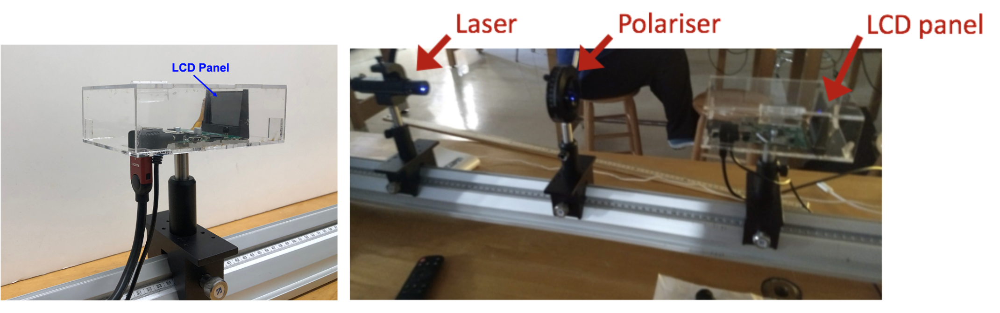

# Module 2 Week 2 During Lab

## Goals for This Week

If you need to revisit aspects of last week's investigation, you should have some time to do so this week by spending less time on the last, open-ended part of this week's activities.

Your formal, quantitative goal this week is to measure the vertical and horizontal spacing of pixels on the LCD panel we have provided, using a two-dimensional version of the diffraction technique you used in Week 1.  You will also measure the physical dimensions of the LCD panel, and determine a size in pixels from your results.  That is, at the end of this week's careful measurements you will be able to say that the LCD panel is (number $$\pm$$ uncertainty) pixels across by (number $$\pm$$ uncertainty) pixels high.

All your diffraction measurements up to and including the LCD panel above have been done by transmitting laser light straight through the object being studied.  If you wanted to measure your phone screen without tearing it out of the your phone, such an approach would clearly not be viable.  Time permitting, you will spend the rest of this week using diffraction gratings, the LCD panel, and/or your phone to explore how diffraction patterns from light _reflected_ off a periodic array relate to diffraction patterns observed in transmission.

## Instrumentation

Each station should have an LCD panel in an acrylic case that is fastened to an optical post and mounted on the optical rail, as shown in the figure below.

{:target="_blank"}

**Figure 2** --- (left) When you set it up, the laser beam should travel from left to right through the LCD panel. (right) Layout of components on the optical rail. Click on the image to see a larger version.

An HDMI cable to connect the LCD to a computer, as well as a power cable, are attached to the LCD panel. *You will not need to power the panel or use these cables at all for this simple investigation.  Please do not attempt to unplug either of the cables from the acrylic box.*

<!--
One of the goals for this exploration is to dissect (please do not take this literally!) the LCD panel,i.e. to deduce portions of its internal structure and to better understand how it works. 

In terms of deducing the internal structure, it would be nice to be able to 'look' inside. This is not so easy since the features of the LCD panel are quite small. However, humanity overcame this issue years ago when Hans and Zacharias Janssen invented the microscope.
-->
Figure 3 shows a photo taken of our LCD panel via the eyepiece of a microscope. You are encouraged to observe an LCD under the microscope (through the eyepiece) in the rear of the lab. A microscope calibration slide is available that you can use to estimate the pixel spacing if you would like.

 

**Figure 3** --- Microscope image of an LCD panel identical to the one you have on your optical rail. **Note: the LCD that is pre-placed in the microscope is the same model as the one on your optical rail. Please do not disassemble your own LCD or its housing, and please do not touch the LCD panel area itself.**

Figure 4 --- There is a calibration slide by the microscope that you can use to calibrate length scales in your view. The finest lines in the grid feature near the center of the slide are $$10 \mu m$$

<!--
The LCD has structure that looks like a two-dimensional array of windows, or two-dimensional array of slits. In other words, it has a diffraction grating-like structure. It makes sense, then, that if we shine a laser through, there ought to be some sort of diffraction pattern. -->

Another LCD panel of the same model can be found at the instructor bench at the front of the lab, along with the complete disassembled projector it came from.  Use the LCD panel at the instructor bench when you need to measure the physical size of the LCD array using a ruler or calipers.  This way, only one LCD panel will get handled extensively and build up fingerprints and scratches on its surface.

## Data Collection

To get a sense of what the diffraction pattern of a two-dimensional grating look like, take two 500-line/mm gratings and stack them like two pieces of paper, but with one grating rotated so its lines are perpendicular to the lines of the first grating.  Mount this two-grating sandwich on the optical rail as you would mount a single grating, and shine the laser through both gratings. You do not need to collect any formal data; just describe in your lab notebook what the diffraction pattern from a 2-dimensional grid looks like.  Replace one or the other grating with a 1000-line/mm grating and note how the diffraction pattern changes.

Now mount the LCD on your optical rail and shine your laser through the LCD (refer to Fig. 2). You will see a pattern of bright dots creating a rectangular grid, with roughly uniform spacing between maxima. By observing the distance  ($$x$$ or $$y$$) between these maxima, and finding the values of $$L$$ required to produce given $$x$$ or $$y$$ values, you can determine the spacing of the pixels in both directions. Based on your experience with last week's investigation, design and execute a procedure for taking reliable data and analyzing it to find the LCD pixel spacing both horizontally and vertically.

Measure the physical dimensions of the LCD using the unmounted one at the instructor's bench. You can use the pixel spacing and the physical dimensions of the array to determine a number of pixels horizontally and vertically across the panel.

Finally, use a diffraction grating, the LCD panel, and/or your phone screen to explore what a diffraction pattern looks like when light is _reflected_ rather than transmitted off a periodic array.  What about when light shines on the periodic array _at an angle_ and is reflected? Get creative with paper, tape, and mounts to view the reflected patterns as best you can!  You could also do some internet research to help make sense of what you are seeing.  This portion of the lab might give you some ideas for a tech report at the end of the semester.
